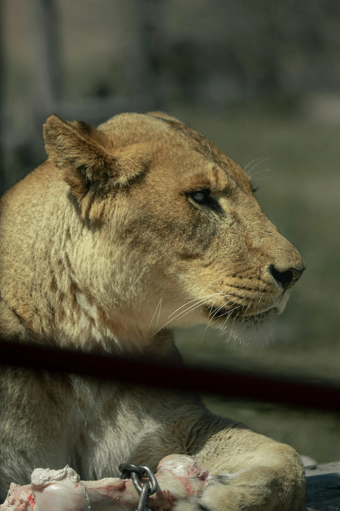

# 🌐 Web Portfolio — Milton Escamilla

Personal portfolio developed as part of the **RIWI** software development program. The project applies responsive design, CSS optimization, and basic JavaScript fundamentals to create a modern and functional web experience.

---

## 📁 Project Structure

```
portafolio/
├── index.html
├── public/
│   └── img/
│       ├── milton.webp
│       ├── riwi.webp
│       ├── capture.png
│       ├── leontitle.webp
│       ├── aguila.webp
│       ├── cone.webp
│       ├── delfin1.webp
│       ├── oso.webp
│       └── perro.webp
└── src/
    ├── css/
    │   ├── styles.css        # Global variables and reset
    │   ├── header.css        # Header and hamburger menu styles
    │   ├── section.css       # Sections, projects and form
    │   ├── about-me.css      # Hero / About Me and images
    │   ├── footer.css        # Footer styles
    │   ├── responsive.css    # General media queries
    │   └── style_min.css     # Minified CSS (simulation)
    ├── scripts/
    │   └── scripts.js        # JavaScript interactivity
    └── views/
        ├── mascotas.html     # Pets page
        └── mascotas.css      # Pets page styles
```

---

## 🚀 Technologies Used

- **HTML5** — Semantic structure
- **CSS3** — Variables, Flexbox, Grid, Media Queries
- **JavaScript** — DOM manipulation and interactivity

---

## ✅ Features

### 🎨 Responsive Design
- Media queries for **mobile** (≤ 600px), **tablet** (≤ 900px) and **desktop**
- Functional hamburger menu on mobile devices
- Adaptive project layout: 3 columns → 2 columns → 1 column

### 🖼️ Responsive Images
- All images use `max-width: 100%` and `height: auto`
- Optimized `.webp` formats

### 🎯 Optimized CSS
- Global variables defined in `:root` (colors, typography, shadows, borders)
- Modular CSS architecture separated by components
- `style_min.css` file with minified CSS

### ⚡ JavaScript Interactivity
- **Welcome message** that appears on page load and disappears automatically
- **Hamburger menu** that shows/hides navigation on mobile
- **Send button** that changes the main paragraph text on click

---

## 📱 Media Queries

| Breakpoint | Behavior |
|---|---|
| `≤ 600px` (mobile) | Nav in column, projects 1 column, full width inputs |
| `≤ 900px` (tablet) | Projects in 2 adaptive columns |
| `≤ 991px` (header) | Hamburger menu visible, header in column |
| `> 900px` (desktop) | 3-column layout |

---

## 📂 Pages

### `index.html` — Main Page
- **Hero / About Me:** Personal introduction with profile photo
- **Projects:** Grid with projects developed at RIWI
- **Contact:** Form with JavaScript interaction

### `mascotas.html` — Pets Gallery
- Grid gallery with 6 pets
- Fully responsive (2 columns on tablet, 1 on mobile)

---

## 🖼️ Preview

### Portfolio


### Profile


---

## 🐾 Pets Gallery

| | | |
|---|---|---|
|  |  |  |
| **Rex** 🦁 | **Lup** 🐶 | **Coco** 🐰 |
|  |  |  |
| **Beer** 🦅 | **Pilon** 🐻 | **Murphy** 🐬 |

---

## 🛠️ How to Use

1. Clone or download the repository
2. Open `index.html` in your browser
3. You can also use **Live Server** in VS Code for local development

```bash
# If you have Live Server installed
# Right click on index.html → Open with Live Server
```

---

## 👨‍💻 Author

**Milton Escamilla**
Software development student — RIWI
📧 escamilladaniel28@gmail.com


---
view of the page: https://escamilladaniel28-cpu.github.io/
## 📚 Week

Workshop Week 3 — Media queries, responsive design and basic JavaScript optimization
